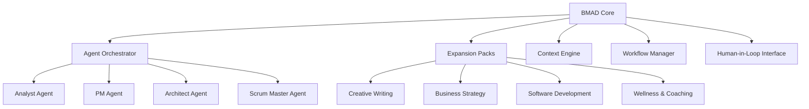

# BMAD Method™ - Universal AI Agent Framework

> **B**reakthrough **M**ethod for **A**gile **A**I-**D**riven Development

Transform your development workflow with intelligent AI agents that think, plan, and execute like a seasoned team of experts.

---

## 🎯 What is BMAD Method?

BMAD Method is a revolutionary universal AI agent framework designed for agile, AI-driven development across multiple domains. Unlike traditional development approaches, BMAD eliminates planning inconsistency and context loss by employing specialized AI agents that work together as a cohesive team.

### 🔥 Key Innovations

#### 1. **Agentic Planning**
- **Analyst Agent**: Conducts market research and competitive analysis
- **Product Manager Agent**: Creates detailed, consistent Product Requirements Documents (PRDs)
- **Architect Agent**: Designs system architecture with implementation guidance
- Advanced prompt engineering with human-in-the-loop refinement

#### 2. **Context-Engineered Development**
- **Scrum Master Agent**: Transforms high-level plans into hyper-detailed development stories
- Embeds full context, implementation details, and architectural guidance in every story
- Maintains consistency across the entire development lifecycle

---

## 🚀 Quick Start

### Prerequisites
- Node.js v20+
- Your favorite terminal

### Installation
```bash
npx bmad-method install
```

That's it! BMAD Method will automatically:
- Set up your development environment
- Install core agents
- Configure expansion packs
- Enable automatic updates

---

## 🌟 Core Features

### Multi-Agent Architecture
- **Specialized Agents**: Each agent has distinct expertise and responsibilities
- **Collaborative Workflow**: Agents work together to solve complex problems
- **Domain Flexibility**: Supports software, creative writing, business, wellness, and more

### Expansion Pack Ecosystem
- **Creative Writing Pack**: Story creation, character development, narrative design
- **Business Pack**: Market analysis, strategy planning, competitive research
- **Wellness Pack**: Health coaching, habit formation, mindfulness practices
- **Software Development Pack**: Code architecture, testing strategies, deployment

### Context-Aware Intelligence
- Maintains project context across all interactions
- Eliminates repetitive explanations and setup
- Ensures consistency in large, complex projects

---

## 💡 Use Cases

### Software Development
```bash
bmad create project --type web-app --name "my-saas"
bmad agent analyst --task "market-research" --domain "fintech"
bmad agent pm --create-prd
bmad agent architect --design-system
```

### Creative Writing
```bash
bmad create story --genre "sci-fi" --length "short"
bmad agent plot-architect --create-outline
bmad agent character-psychologist --develop-characters
bmad agent narrative-designer --draft-story
```

### Business Strategy
```bash
bmad create business-plan --industry "e-commerce"
bmad agent analyst --competitor-analysis
bmad agent strategist --go-to-market-plan
bmad agent financial-analyst --revenue-projections
```

---

## 🏗️ Architecture Overview



---

## 📚 Documentation

| Resource | Description |
|----------|-------------|
| [User Guide](docs/user-guide.md) | Complete setup and usage instructions |
| [Core Architecture](docs/core-architecture.md) | Technical deep-dive into BMAD's design |
| [Expansion Packs](docs/expansion-packs.md) | Available packs and how to use them |
| [API Reference](docs/api-reference.md) | Detailed API documentation |
| [Troubleshooting](docs/troubleshooting.md) | Common issues and solutions |

---

## 🔗 BMAD Ecosystem & Related Projects

### Official Repositories
- **[BMAD Method Core](https://github.com/cdwbrad/bmad-method)** - Main framework and core agents
- **[BMAD Method Experiments](https://github.com/bookmark/BMAD-METHOD-EXP)** - Experimental features and community contributions

### Expansion Packs & Extensions
- **[Whiteport Sketch-to-Code](https://github.com/whiteport-collective/whiteport-sketch-to-code-bmad-expansion)** - Transform design sketches into functional code using BMAD agents
- **Creative Writing Pack** - Story creation, character development, and narrative design tools
- **Business Strategy Pack** - Market analysis, competitive research, and strategic planning agents
- **Wellness & Coaching Pack** - Health coaching, habit formation, and mindfulness practices

### Community Projects
- **Templates & Workflows** - Ready-to-use project templates for different domains
- **Custom Agents** - Community-built specialized agents for specific use cases
- **Integration Libraries** - Connect BMAD with popular tools and platforms

### Learning Resources
- **Documentation Hub** - Complete guides, tutorials, and API references
- **Video Tutorials** - Step-by-step walkthroughs and case studies
- **Community Showcase** - Real-world projects and success stories

---

## 🌍 Community & Support

### Join the Community
- **Discord**: Join our active community of developers and creators
- **YouTube**: Watch tutorials, demos, and case studies
- **GitHub Discussions**: Ask questions, share projects, get help

### Contributing
We welcome contributions! Whether you're:
- Building new expansion packs
- Improving core functionality  
- Writing documentation
- Sharing use cases and tutorials

Check out our [Contributing Guide](CONTRIBUTING.md) to get started.

---

## 🎉 Success Stories

### "Reduced Planning Time by 80%"
> "BMAD Method transformed our development process. What used to take weeks of planning now happens in hours, and the quality is consistently higher." - Sarah Chen, CTO at TechStart

### "From Idea to MVP in Days"
> "The agentic approach helped us validate our business idea and build our first prototype faster than we ever imagined possible." - Marcus Rodriguez, Founder of FinanceAI

### "Writing Became a Collaborative Joy"
> "As a novelist, BMAD's creative writing agents became my perfect co-authors. They understand story structure better than most humans I know." - Emma Thompson, Author

---

## 🔮 What's Next?

### Upcoming Features
- **Visual Workflow Builder**: Drag-and-drop agent orchestration
- **Real-time Collaboration**: Multi-user agent sessions
- **Custom Agent Creation**: Build your own specialized agents
- **Integration Hub**: Connect with popular tools and platforms

### Roadmap
- Q1 2024: Mobile companion app
- Q2 2024: Enterprise-grade security features  
- Q3 2024: Multi-language support
- Q4 2024: Advanced AI model integration

---

## 📄 License

BMAD Method is open-source software licensed under the [MIT License](LICENSE).

---

## 🙏 Acknowledgments

Built with ❤️ by the BMAD Method team and our amazing community contributors.

Special thanks to:
- Early adopters who provided crucial feedback
- Open-source contributors who help improve BMAD daily
- The AI research community pushing the boundaries of what's possible

---

<div align="center">
  
**Ready to revolutionize your development workflow?**

[Get Started Now](https://github.com/cdwbrad/bmad-method/blob/main/docs/quick-start.md) • [Join Discord](https://discord.gg/bmad-method) • [Watch Demo](https://youtube.com/bmad-method)

</div>
